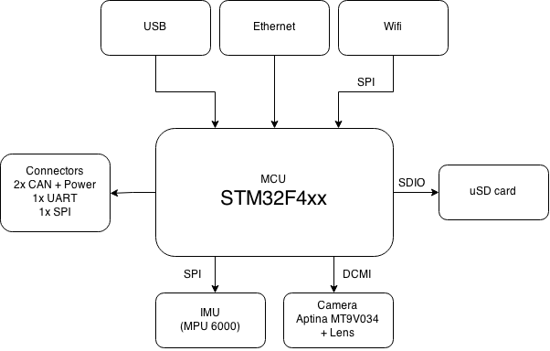

Cyclops the vision module
=========================

The aim of this project is to design a vision module board that is able to stream video via Ethernet/Wifi or process it onboard and output information (visual odometry, target tracking, etc) via CAN, SPI or UART.

### Block diagram

